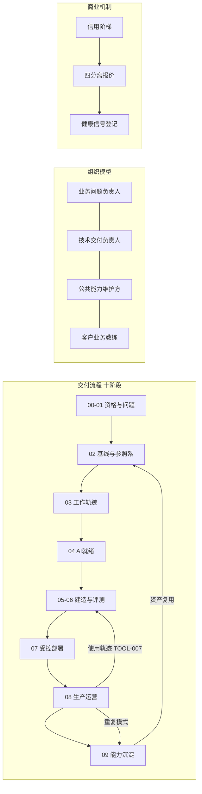

# 系统总览图（5 分钟看懂 FDE OS）

**这是什么**：通元问科交付操作系统（FDE OS）的导航页。它规定一个 AI 项目从「客户提出问题」到「能力沉淀复用」怎么走、每步凭什么放行、谁负责、什么时候必须停。**当前状态：候选机制骨架收口，未经真实项目现场验证。**

**三条铁律**：高风险动作（付款/合同/不可逆处置）的放行权永远在客户原有审批角色｜没有基线不得宣称提升百分比｜一次真实使用≠现场验证。

**闸门**（GATE-0~7，候选）：值不值得做→问题定义→基线存在→AI 就绪→MVP 价值→Eval 达标→生产风险→值得规模化。放行六态：通过/有条件通过/退回补充/缩小范围/暂停/终止。

**使用状态**（U1-U5）：原型验证→上线准备→受控上线→真实使用已发生→现场验证（U4 起用 TOOL-007 采集）。

## 三档阅读路径
| 你有多少时间 | 读什么 | 回答 |
|---|---|---|
| 5 分钟 | 本页 | FDE OS 是什么、边界在哪 |
| 30 分钟 | [团队手册](../08_Outputs/团队手册_候选版_v0.1.md)你关心的那一章 | 这个阶段怎么做 |
| 现场 | [工具包](../05_Field_Toolkit/)对应工具 | 我现在填什么、问什么、何时停 |

## 仓库地图
[核心原则](../01_Doctrine/核心原则_v0.1.md)｜[组织模型](../02_Operating_Model/组织模型_v0.1.md)｜[交付流程](../03_Delivery_Playbook/)（[链路对齐](../03_Delivery_Playbook/链路对齐总表_v0.1.md)/[能力沉淀](../03_Delivery_Playbook/能力沉淀_v0.1.md)）｜[商业机制](../04_Commercial_Engine/商业模型_v0.1.md)｜[现场工具 ×10](../05_Field_Toolkit/)｜[证据库](../06_Evidence_Library/)｜本页｜[手册/FAQ](../08_Outputs/)｜[研究记录](../09_Research_Notes/)｜[决策记录](../10_Decision_Log/Decision_Log.md)
